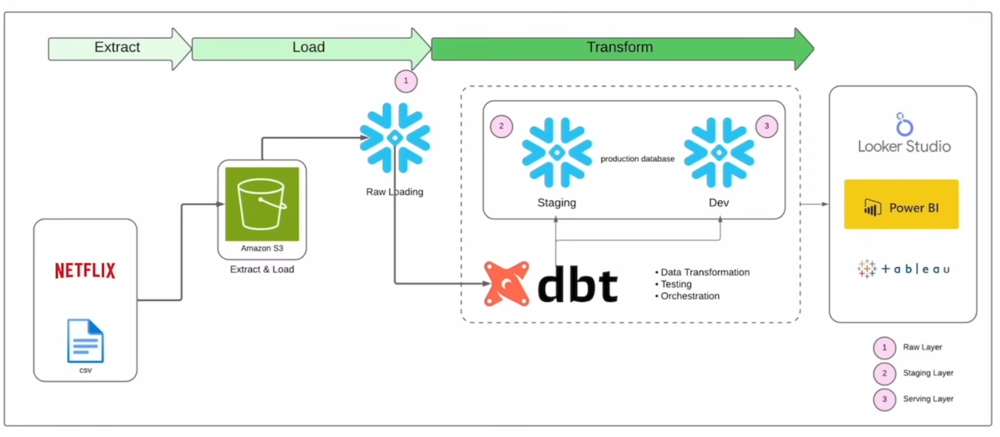

# 🎬 Netflix Data Analysis — dbt & Snowflake

An end-to-end **ELT data engineering project** built with **dbt and Snowflake** to transform and model MovieLens data for analytics.

## 🏗️ Data Architecture



## 🛠️ Tech Stack

* **Data Warehouse:** Snowflake
* **Transformation:** dbt Core
* **Language:** SQL
* **Package:** dbt-utils
* **Environment:** Python, uv
* **Version Control:** Git & GitHub

## 🔄 Project Highlights

* Built a layered **Staging → Dimension → Fact → Mart** data model.
* Implemented **incremental models** for efficient processing of rating data.
* Implemented **dbt snapshots** for historical tracking of tag data.
* Added **source definitions, schema tests, custom SQL tests, macros, and seeds**.
* Used `ref()` for model dependencies and automated DAG generation.
* Implemented data quality checks with **16 passing dbt tests**.
* Created analytical models for movie releases, ratings, tags, and genome scores.

## 📂 Project Structure

```text
netflix_analysis_dbt/
│
├── docs/
│   └── data_architecture.png
│
├── netflixDBT/
│   ├── models/
│   │   ├── stagging/
│   │   ├── dim/
│   │   ├── fact/
│   │   └── mart/
│   ├── macros/
│   ├── snapshots/
│   ├── seeds/
│   ├── tests/
│   ├── analyses/
│   ├── dbt_project.yml
│   └── packages.yml
│
├── src/
├── pyproject.toml
├── requirement.txt
└── README.md
```

## ▶️ Run Locally

```bash
uv sync
dbt deps
dbt debug
dbt build
```

## 📊 Data Sources

The project uses MovieLens datasets containing:

* Movies
* Ratings
* Tags
* Genome Tags
* Genome Scores
* Movie Links

## 👩‍💻 Author

**Manshi Gupta**
B.Tech Data Science

[GitHub](https://github.com/ManshiGupta1)
